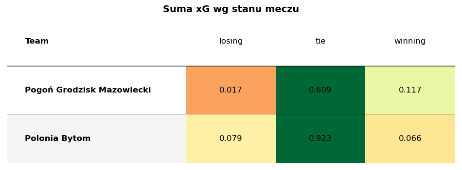
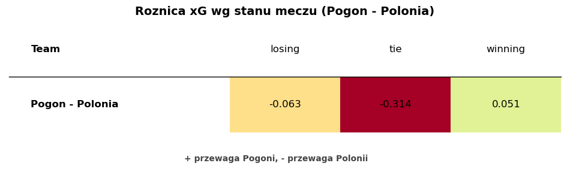
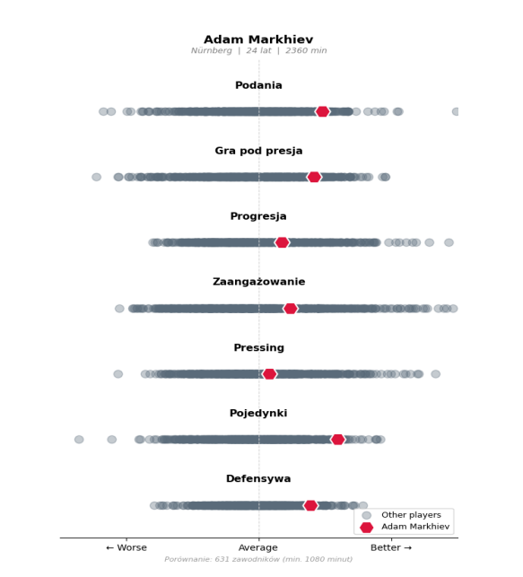
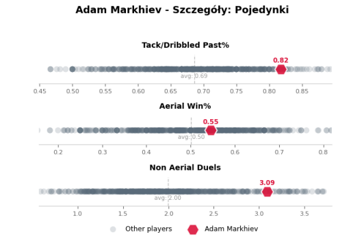

# recruitment-task-pogon

Rozwiązanie zadania rekrutacyjnego na staż analityka danych w Pogoni Grodzisk Mazowiecki. Repozytorium zawiera odpowiedzi na dwa pytania: obliczenie różnicy xG względem stanu meczu (kod w `zadanie1.ipynb`) oraz opis podejścia do oceny zawodnika na wahadłowego.

## Zadanie 1 — różnica xG wg stanu meczu

Dla obu drużyn policzyłem sumę xG w rozbiciu na stan meczu: kiedy drużyna przegrywała, remisowała i wygrywała.

Pierwsza tabela pokazuje surową sumę xG każdej drużyny w danym stanie meczu.

Druga tabela pokazuje różnicę xG między drużynami (Pogoń − Polonia) w każdym stanie meczu. To bezpośrednia odpowiedź na pytanie: dodatnia wartość oznacza przewagę Pogoni, ujemna przewagę Polonii.

## Zadanie 2 — ocena zawodnika na wahadłowego

Na samym początku chcę mieć pewność, czego trener wymaga od danego zawodnika. To punkt wyjścia do całej dalszej pracy, bo dopiero na tej podstawie mogę dobrać statystyki, które będą odzwierciedlać styl gry oraz rolę, jaką zawodnik ma pełnić w naszym systemie. Dlatego dobra komunikacja i jasno ustalone cele są tu kluczowe.

Warto tu od razu zaznaczyć jedną rzecz o samych danych, bo to wpływa na to, ile da się zrobić. Robi dużą różnicę, czy pracuję na surowych danych eventowych, czy na gotowym pliku .csv z już zagregowanymi, zliczonymi i znormalizowanymi wartościami per 90. Mając dane eventowe, sam ustalam definicje statystyk i buduję własne metryki, np. xThreat, dzięki czemu jestem znacznie bardziej świadomy, co dana wartość oznacza i jak wyciągać z niej wnioski. Dane eventowe dają też większą swobodę w samej normalizacji, bo nie muszę się ograniczać do wartości per 90. Mogę np. liczyć statystyki per 100 possessions. Ma to znaczenie, bo taka normalizacja podbija zawodników z drużyn o np. mniejszym posiadaniu lub bardziej defensywnym stylu, którzy systemowo mają mniej okazji, w stosunku do zawodników z drużyn dominujących, grających dużo ofensywnej piłki. Różne metody normalizacji dają więc różny obraz tego samego zawodnika, dlatego ważne jest, żeby świadomie wybrać tę pasującą do pytania, na które odpowiadam. Dostając gotowe agregaty, mogę zrobić mniej, bo jestem ograniczony do tego, co ktoś policzył wcześniej, i muszę zaufać jego definicjom.

Samą ocenę zawodnika rozbijam na kilka etapów. Na początku chcę wiedzieć, jak zawodnik w wybranych aspektach gry wygląda na tle wszystkich zawodników na tej pozycji. Robię to na próbce, którą mamy w danych, z pewnymi założeniami: ta sama pozycja, minimalny próg rozegranych minut oraz zawodnicy z lig, z których posiadamy dane lub które są porównywalne do naszej. Chodzi o to, żeby jego wartości miały punkt odniesienia.

Zamiast polegać tylko na pojedynczych statystykach, łączę je w szersze aspekty gry. Zamiast traktować osobno np. Passing%, Successful Passes i Long Ball%, łączę je w jeden nadrzędny aspekt gry opisujący podania. Robię to po to, żeby łatwiej było przekazać, w czym zawodnik jest dobry, bez konieczności pokazywania każdej najmniejszej statystyki i przytłaczania odbiorcy ich milionem. Jeśli potem ktoś zapyta, w jaki sposób zawodnik wyróżnia się akurat w podaniach, mogę zejść poziom niżej i pokazać, jak prezentuje się w każdej pojedynczej statystyce opisującej ten aspekt. Każdy taki aspekt gry powstaje z kilku statystyk liczonych jako z-score, czyli miary pokazującej, o ile dany zawodnik odstaje od średniej (0 to średnia, wartość dodatnia oznacza powyżej, ujemna poniżej). Dzięki temu można sprowadzić do wspólnej skali statystyki liczone w zupełnie różnych jednostkach i porównywać je ze sobą. Budując metrykę opisującą dany aspekt gry, poszczególne statystyki mogę ważyć różnie, zależnie od tego, jak istotne są dla danej roli.

Statystyki grupuję tutaj przykładowo w sześć kategorii. Sam dobór statystyk nie jest przypadkowy: wychodzę od tego, co trener opisał słowami, jakich cech oczekuje od zawodnika na tej pozycji, i staram się jak najlepiej przełożyć te opisowe wymagania na konkretne, mierzalne statystyki. Poniższy podział nie jest więc sztywny, a raczej moją próbą takiego tłumaczenia, w której mogą jeszcze brakować trafnych nazw dla poszczególnych grup i lepiej dobranych statystyk, bo na tym etapie służy to tylko za przykład:

- **Progresja** – np. Deep Progressions, Carries, Pass OBV, Line Breaking Passes Completed
- **Wytrzymałość / intensywność** – np. HSR, dystans
- **Zaangażowanie w grę** – np. Touches, Received Passes, Aerial Win%, xGBuildup
- **Kreacja** – np. Deep Completions, xG Assisted, Key Passes, Successful Dribbles
- **Podania** – np. Passing%, Successful Passes, Long Ball%, Line Breaking Passes/Pass%
- **Defensywa** – np. Tackles & Interceptions, Ball Recoveries, Defensive Action OBV, Tack/Dribbled Past%

Dla przykładowego wahadłowego największą wagę z mojego zestawienia mogą mieć takie aspekty jak wytrzymałość/intensywność, progresja oraz tworzenie sytuacji.

Mając już policzone aspekty gry, w pierwszej kolejności zestawiam zawodnika z pozostałymi graczami na tej samej pozycji, na wykresie pokazującym go na tle innych. Każdy aspekt gry jest tam osobnym wierszem, na którym rozłożeni są wszyscy zawodnicy od najsłabszych do najlepszych, a badany zawodnik jest wyróżniony osobnym znacznikiem. Od razu widać wtedy, w których obszarach należy do czołówki, w których jest przeciętny, a w których wypada poniżej średniej.

Kolejnym krokiem może być naniesienie na ten sam wykres, pokazujący zawodnika na tle innych, zarówno zawodnika X, jak i naszego obecnego wahadłowego. Widać wtedy od razu, który z nich w których aspektach gry wypada lepiej, a w których gorzej.

Znając już te aspekty, schodzę poziom niżej i porównuję obu zawodników bezpośrednio na pojedynczych statystykach, które się na te aspekty składają. Mogę to zrobić na wykresie typu radar albo na distribution plocie (czyli tym samym typie wykresu co wcześniej, pokazującym zawodników na tle innych), tyle że rozbitym już na konkretne statystyki zamiast całych aspektów. Radar, będący jednym ze standardów w branży, zwykle opiera się na percentylach, czyli pokazuje, jaki procent zawodników na tej pozycji dany gracz przewyższa w danej statystyce.

Najważniejsze jest przy tym to, że moim zadaniem jest przedstawić te wszystkie dane w jak najlepszy i najbardziej zrozumiały sposób, tak aby umożliwić ludziom podjęcie decyzji z jak największą świadomością. Oprócz samego opowiedzenia danych chcę też przekazać swoją rekomendację, która z nich wynika. Chodzi o to, żeby również osoby, które na co dzień nie zajmują się danymi, mogły jasno zobaczyć plusy i minusy danego gracza. Same dane nie mają podejmować decyzji za trenera czy dyrektora sportowego, tylko dać im solidny punkt oparcia i ograniczyć ryzyko pomyłki, a nawet najlepiej policzone metryki są bezużyteczne, jeśli osoba decyzyjna ich nie zrozumie albo źle je odczyta.

Na koniec przechodzę do drugiej części pytania, czyli tego, gdzie te dane mnie zawodzą. Warto od razu zaznaczyć, że całe to podejście nie jest sztywne i płynnie zmienia się zależnie od kontekstu, danych, jakimi dysponuję, i pytania, na które odpowiadam.

Sporo zależy już od samego tego, że najpewniej pracuję na gotowych metrykach StatsBomb, a nie na własnych zbudowanych z danych eventowych. Dobrym przykładem jest xG, które u każdego dostawcy powstaje na innym modelu, więc jego wartość dla StatsBomb i dla Wyscout potrafi się różnić. Nie znam dokładnie tego, jak StatsBomb liczy swoje metryki, więc nie mam pełnej pewności, co tak naprawdę kryje się pod daną metryką. To nie przekreśla analizy, ale każe traktować takie wartości z pewną ostrożnością.

Do tego dochodzi wpływ systemu, bo zawodnik jest częścią jakiegoś systemu i ten system na niego wpływa. Dlatego ważne jest, żeby dobrze przyjrzeć się np. statystykom opisującym styl gry danej drużyny i poznać szerszy kontekst, czyli sprawdzić, czy dany zawodnik nie jest przypadkiem tylko beneficjentem systemu, w którym gra. Ograniczeniem bywa również sama próbka: 20 meczów, w których ktoś był np. zmiennikiem albo schodził w 60. minucie, może okazać się za małe, żeby wyciągać z nich pewne wnioski. Osobną kwestią są dane fizyczne, które dla tej roli są istotne (akceleracje, top speed / PSV-99). Nie znam dokładnie tego, co pod tym względem oferuje StatsBomb, więc nie jestem pewny, jak dużo takich danych dostarcza ani jakiej są jakości.

Największym ograniczeniem jest jednak sytuacja, w której nie mam dostępu do danych innych zawodników. Wtedy całe to podejście się sypie, bo tracę jakikolwiek punkt odniesienia, a samo operowanie na statystykach w oderwaniu od porównania z innymi mija się z celem.

---

Poniższe wykresy dołączam jako przykład zastosowania opisanego podejścia na innych danych (nie na danych z tego zadania).

